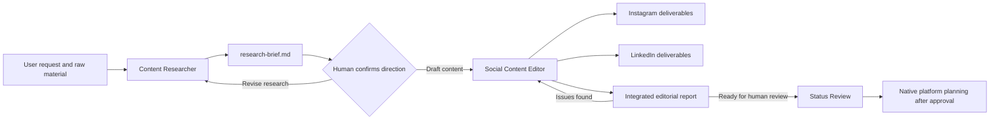
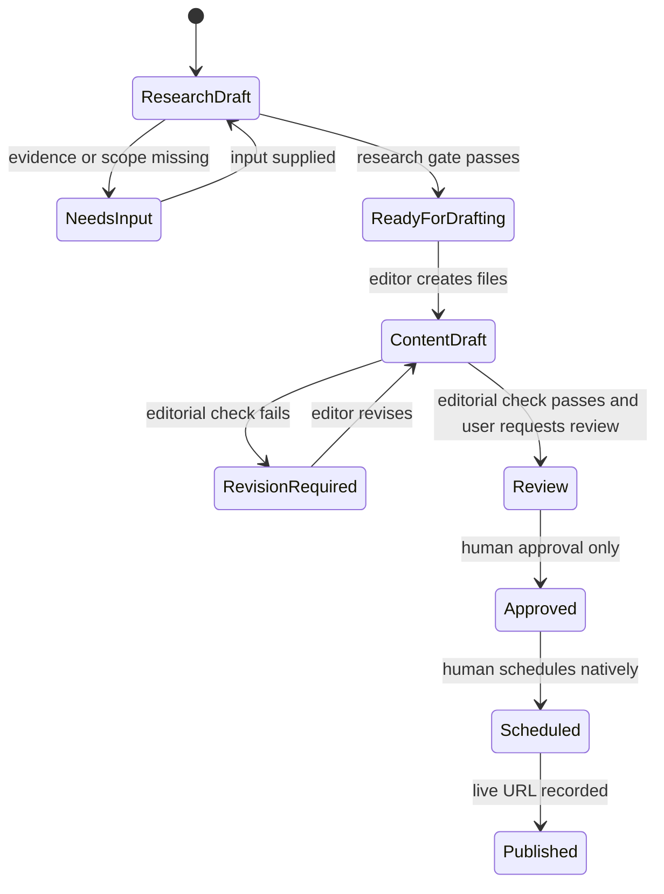

# Content agents concept

**Decision date:** 2026-07-12  
**Status:** Agents implemented — pending validation  
**Scope:** Initial Qnit content workflow for research, Instagram, and LinkedIn

## Implementation status

| Agent | File | Status |
| --- | --- | --- |
| Content Researcher | [.github/agents/content-researcher.agent.md](../.github/agents/content-researcher.agent.md) | Implemented |
| Social Content Editor | [.github/agents/social-content-editor.agent.md](../.github/agents/social-content-editor.agent.md) | Implemented |

Both agents are created with minimal tool whitelists and no publishing access, and are wired together with agent handoffs (researcher → editor per platform, editor → researcher for missing evidence). Validation against a real campaign folder (concept steps 2 and 4) and the repository upload (step 6) are still outstanding.

## Purpose

Qnit will start with two repository-local GitHub Copilot agents:

1. **Content Researcher** - extracts reliable material, records sources, and proposes a rough content plan.
2. **Social Content Editor** - turns an approved research brief into Instagram and LinkedIn deliverables and performs the initial editorial review itself.

The agents support the content-as-code workflow. They do not schedule or publish content. Uploads will initially be planned natively in Instagram and LinkedIn; Buffer remains a future integration target.

## Design decisions

| Decision | Rationale |
| --- | --- |
| Use two agents rather than one | Research provenance and editorial writing are separate responsibilities. This reduces unsupported claims and keeps handoffs reviewable. |
| Use one mandatory handoff file | A structured `research-brief.md` gives the editor a stable, auditable input contract. |
| Integrate editorial review into the editor initially | This keeps the first implementation small while preserving a visible quality gate. The review can become a separate agent later. |
| Keep platform outputs distinct | Instagram and LinkedIn require different hooks, tone, length, CTA, hashtags, assets, and formats. Cross-posting must be adaptation, not duplication. |
| Keep publishing out of both agents | Drafting agents must not access Instagram, LinkedIn, Buffer, credentials, or publishing tools. |
| Extract only the brief scaffold into a skill | The research brief contract is reused and format-stable, so it lives inline in a `write-research-brief` skill. Broader skill extraction stays deferred until the workflow is tested on real content. |
| Wire the workflow with agent handoffs | The Content Researcher offers platform-specific handoffs to the Social Content Editor, and the editor offers a return handoff for missing evidence. Agents stay self-contained and do not load this concept document at runtime. |
| Give each post its own folder | Every post's draft, caption, and post-specific assets live together in `<platform>/<type>/YYYY-MM-DD-short-slug/`, so a post is a self-contained unit rather than loose files in a platform root. |

## Existing foundations

No existing agent covers the complete Qnit workflow unchanged. The implementation should adapt proven parts of these public components:

| Existing component | Reuse | Required adaptation |
| --- | --- | --- |
| [`task-researcher.agent.md`](https://github.com/github/awesome-copilot/blob/main/agents/task-researcher.agent.md) | Structured source analysis, evidence capture, and explicit research output | Replace software-task fields with communication goals, audiences, claims, quotes, content angles, and platform opportunities. |
| [`linkedin-post-writer.agent.md`](https://github.com/github/awesome-copilot/blob/main/agents/linkedin-post-writer.agent.md) | Source-to-post workflow, hook/body/CTA structure, read-oriented drafting | Add Instagram, Qnit templates, repository paths, plain-text captions, restrained formatting, Qnit voice, and integrated review. |
| Doublecheck agent/skill from `github/awesome-copilot` | Verification pattern for factual claims and source conflicts | Incorporate a lightweight evidence check; do not add a separate agent in the initial version. |
| Markdown Accessibility Assistant from `github/awesome-copilot` | Human-reviewed alt-text pattern | Apply only the relevant alt-text and clarity checks for social assets. |

These components are references, not dependencies. Their instructions must be reviewed and rewritten for Qnit rather than copied unchanged.

## Agent collaboration



The human confirmation between research and drafting may be explicit in chat. The editor must not infer that an exploratory brief has been approved merely because it exists.

### Agent handoffs

The workflow is wired with VS Code agent handoffs so the user can move between stages:

| From | Handoff | To | Effect |
| --- | --- | --- | --- |
| Content Researcher | Draft Instagram content | Social Content Editor | Draft with platform focus `instagram` |
| Content Researcher | Draft LinkedIn content | Social Content Editor | Draft with platform focus `linkedin` |
| Content Researcher | Draft for both platforms | Social Content Editor | Draft both, each genuinely adapted |
| Social Content Editor | Request more research | Content Researcher | Return the brief for missing evidence or conflicting sources |

The researcher handoffs do not auto-send, preserving the human confirmation gate before drafting.

## Shared repository context

Both agents inherit repository-level instructions and use these files as authoritative context:

- `README.md` - workflow, status values, paths, naming, and caption conventions
- `brand/brand-voice.md` - audience, content pillars, voice, platform tone, links, and handles
- `brand/hashtag-bank.md` - curated platform-specific hashtag sets
- `templates/content-brief.md` - planning fields and campaign intent
- `source-material/README.md` - source organization and traceability rules
- The `write-social-content` skill - platform templates for the requested format

Agents must reference these files rather than duplicate their full contents in the agent definitions.

## Agent 1: Content Researcher

### Mission

Turn a topic, URL, document, transcript, note set, or campaign folder into a concise and traceable research brief that gives the Social Content Editor enough reliable material to create platform-specific content.

### Responsibilities

- Clarify the communication objective, audience, platform scope, and desired formats when they cannot be inferred safely.
- Read all relevant repository source material before using external sources.
- Extract facts, arguments, quotes, examples, terminology, links, handles, and asset opportunities.
- Separate verified facts from interpretations, hypotheses, and ideas.
- Record a source for every material external claim.
- Identify missing evidence, consent, attribution, dates, names, or assets.
- Propose a rough content map for Instagram and LinkedIn without writing final post copy.
- Create or update the handoff file only after showing the proposed scope to the user when the source set is ambiguous.

### Non-responsibilities

The Content Researcher does not:

- Write final captions, posts, articles, Story frames, or Reel scripts.
- Invent quotes, metrics, customer outcomes, product capabilities, names, roles, or event details.
- Treat search snippets or AI summaries as primary evidence when an original source is available.
- Change brand guidance, platform templates, post drafts, captions, calendars, or carousel assets.
- Approve, schedule, or publish content.
- Access social-media or Buffer credentials.

### Proposed tools

The implementation should whitelist only capabilities equivalent to:

| Capability | Purpose |
| --- | --- |
| Repository read | Read brand guidance, templates, source material, and briefs. |
| Repository search | Locate related campaigns, previous content, terminology, and local evidence. |
| Web fetch/search | Retrieve user-provided sources and find authoritative supporting material when requested. |
| Narrow file edit | Create or update `research-brief.md` inside the selected `source-material/` topic folder. |

No terminal, publishing, social-network write, credential, or broad repository mutation capability is required.

### Required output

Default path:

```text
source-material/<category>/<topic-slug>/research-brief.md
```

For an existing campaign folder, the brief belongs in that folder. The agent must not create a second parallel source tree.

### Research brief contract

```markdown
---
title:
status: Draft                 # Draft | Ready for drafting | Needs input
objective:
audience:
content_pillar:
platforms:                    # Instagram | LinkedIn | both
formats:                      # Post | Story | Reel | Article | Carousel
requested_by:
research_date:
---

# Research brief

## Executive summary

## Communication objective

## Audience insight

## Verified key messages

| Claim or message | Evidence | Source | Confidence |
| --- | --- | --- | --- |

## Quotable material

| Exact quote | Speaker | Source | Consent/approval status |
| --- | --- | --- | --- |

## Source inventory

| Source | Type | Relevance | Accessed |
| --- | --- | --- | --- |

## Content opportunities

| Platform | Format | Angle | Why it fits | Required assets |
| --- | --- | --- | --- | --- |

## Recommended narrative

## Required tags, links, and attribution

## Unknowns and risks

## Do not claim

## Handoff status
```

### Evidence rules

| Evidence state | Researcher action |
| --- | --- |
| Supported by an authoritative source | Include it with the exact source and confidence. |
| Supported only by a secondary source | Label it and recommend primary-source verification. |
| Conflicting sources | Record the conflict; do not choose silently. |
| Plausible but unsupported | Put it under `Unknowns and risks` or `Do not claim`. |
| Quote without confirmed wording or consent | Do not present it as publishable. |
| Personal information | Include only what is relevant, supplied for the task, and appropriate for publication. |

### Research completion gate

A brief can use `status: Ready for drafting` only when:

- Objective, audience, content pillar, platform scope, and format scope are clear.
- Every factual claim intended for content has traceable evidence.
- Exact quotes are distinguished from paraphrases.
- Unknowns and prohibited claims are explicit.
- Required links, tags, permissions, and assets are listed.
- The proposed narrative does not overstate the evidence.

Otherwise, the brief remains `Draft` or `Needs input`.

## Agent 2: Social Content Editor

### Mission

Create Qnit-ready Instagram and LinkedIn deliverables from a confirmed research brief, adapt the story for each platform, and run a transparent editorial review before marking the drafts ready for human review.

### Preconditions

The editor requires:

- A `research-brief.md` with `status: Ready for drafting`, or explicit user approval to draft from a named brief that is still in progress.
- A requested platform and format, or explicit permission to recommend them.
- Enough source material to support the key message.
- Any necessary consent or approval for named people, quotes, customer references, or sensitive images.

If a material fact is missing, the editor returns the issue to the user or Content Researcher. It does not perform open-ended research as a substitute for the handoff.

### Responsibilities

- Read the research brief, Qnit brand voice, hashtag bank, and the `write-social-content` skill templates.
- Select one clear key message and CTA per deliverable.
- Create genuinely platform-specific versions rather than duplicating copy.
- Produce the planning Markdown required by the matching `write-social-content` template.
- Produce the final plain-text caption file wherever the repository convention requires one.
- Reference the originating `source-material/` folder in frontmatter or Notes.
- Suggest assets and write useful alt text without claiming visual details that are not known.
- Run the integrated editorial review and report unresolved issues.
- Set new draft files to `status: Draft`; move them to `Review` only after all automated checks pass and the user asks for review readiness.

### Supported initial formats

| Platform | Initial support | Deliverables |
| --- | --- | --- |
| Instagram | Feed post | Planning `.md` plus matching `.caption.txt` |
| Instagram | Reel | Script/shot-list `.md` plus matching `.caption.txt` |
| Instagram | Story | Story-sequence `.md`; caption only when the specific concept needs one |
| LinkedIn | Post | Planning `.md` plus matching `.caption.txt` |
| LinkedIn | Article | Article `.md`; promotional post and caption only when requested |
| Instagram and LinkedIn | Carousel | Copy and narrative may be planned; SVG/PDF/PNG production remains outside the initial agent unless explicitly requested and supported by the existing carousel pipeline. |

Each deliverable lives in its own post folder `<platform>/<type>/YYYY-MM-DD-short-slug/`.

### Non-responsibilities

The Social Content Editor does not:

- Schedule or publish to Instagram, LinkedIn, Reepl, or Buffer.
- Change a post to `Approved`, `Scheduled`, or `Published`.
- Invent missing evidence, quotes, visual details, handles, permissions, or outcomes.
- Modify the research brief to hide evidence gaps.
- Update brand rules or the hashtag bank while drafting.
- Produce the same caption for both platforms with only hashtag changes.
- Use Markdown formatting in final `.caption.txt` files.

### Proposed tools

The implementation should whitelist only capabilities equivalent to:

| Capability | Purpose |
| --- | --- |
| Repository read | Read briefs, brand guidance, templates, and related approved content. |
| Repository search | Find naming collisions, prior posts, assets, approved handles, and terminology. |
| Narrow file edit | Create or update deliverables under `instagram/`, `linkedin/`, and, when explicitly requested, related planning files under `carousels/`. |

Web research and publishing tools should not be included. Factual gaps should be handed back to the Researcher.

### Platform adaptation rules

| Concern | Instagram | LinkedIn |
| --- | --- | --- |
| Primary tone | Personal, visual, warm, celebratory, emoji-friendly | Professional, insight-driven, human, quietly confident |
| Hook | Strong first line or first three seconds | Strong first two or three visible lines |
| Structure | Scannable caption that complements the visual | Clear insight with short paragraphs and deliberate progression |
| CTA | Save, follow, comment, link in bio, DM, or event action | Share experience, discuss, read more, contact, or visit a relevant Qnit page |
| Hashtags | Use an appropriate curated Instagram set and adjust to the topic | Use three to five focused professional hashtags from the bank |
| Assets | Prioritize authentic people, events, real work, and 4:5 or 9:16 formats | Use relevant images, documents, or carousels that clarify the insight |
| Emoji | Natural and purposeful | Sparing and purposeful |

### Integrated editorial review

Before presenting a deliverable as ready for human review, the editor checks:

1. **Evidence** - Every factual claim is supported by the research brief; uncertainty is not rewritten as certainty.
2. **Brand** - Voice is expert, warm, people-first, and quietly confident; language is primarily English unless requested otherwise.
3. **Platform fit** - Hook, structure, tone, CTA, hashtags, and assets suit the selected platform and format.
4. **Differentiation** - Instagram and LinkedIn versions express the same approved message through platform-appropriate angles rather than duplicate wording.
5. **Completeness** - Required frontmatter, source trace, caption, asset path, alt text, links, handles, and Notes are present or visibly marked as unresolved.
6. **Accessibility** - Alt text describes the communication-relevant visual content; Reel/Story text supports sound-off viewing.
7. **Consent and attribution** - Named people, exact quotes, partners, clients, and hosts have the required source and approval status.
8. **Copy quality** - Active voice, sentence case, clear paragraphs, no unsupported superlatives, no fabricated urgency, and one clear CTA.
9. **Operational safety** - Status is not advanced beyond the permitted state, and no publishing action is attempted.

### Editorial result contract

The editor concludes with a compact report in chat or in the draft's Notes section:

```markdown
## Editorial check

- Result: Ready for human review | Revision required | Blocked
- Evidence: Pass | Issues
- Brand voice: Pass | Issues
- Platform fit: Pass | Issues
- Accessibility: Pass | Issues
- Consent/attribution: Pass | Issues
- Missing inputs:
- Files created or updated:
```

`Blocked` is mandatory when a core claim, quote, consent, target account, or required source cannot be verified.

## Handoff and state transitions



Neither agent may perform the final three transitions.

## Error and disagreement handling

- If sources conflict, the Researcher records the conflict and asks for a decision when it changes the message.
- If the Editor finds a claim that is absent from the brief, it removes the claim or requests additional research.
- If a user asks the Editor to publish, it explains that publishing is outside its role and prepares copy-paste-ready files instead.
- If a requested platform format conflicts with available assets, the Editor proposes a feasible alternative and records the missing asset.
- If existing user-authored files contain changes, agents preserve them and edit only the requested content areas.

## Proposed implementation files

Created in this phase:

```text
.github/
├── agents/
│   ├── content-researcher.agent.md   # implemented
│   └── social-content-editor.agent.md # implemented
└── skills/
    ├── write-research-brief/
    │   └── SKILL.md                   # brief structure inlined
    └── write-social-content/
        ├── SKILL.md                   # drafting skill for all formats
        └── assets/                    # 5 platform templates
```

The `write-research-brief` skill owns the brief scaffold inline. The `write-social-content` skill owns the platform templates as assets. All other shared rules remain in repository files rather than being copied into the agent definitions.

## Implementation order

1. [x] Implement `content-researcher.agent.md` with a minimal tool whitelist and the research brief contract.
2. [ ] Validate it against one existing campaign folder and confirm that unsupported claims remain blocked.
3. [x] Implement `social-content-editor.agent.md` with repository-only read/search/edit access and integrated review.
4. [ ] Validate it by producing distinct Instagram and LinkedIn drafts from the same approved brief.
5. [ ] Review both agents for scope, activation descriptions, file permissions, and publishing exclusions.
6. [ ] Only after local validation, prepare the repository for upload to the Qnit Git host and review the remote, branch, and authentication details before pushing.

## Acceptance criteria

### Content Researcher

- Produces a brief at the correct `source-material/` path.
- Gives every publishable factual claim a traceable source.
- Separates exact quotes, paraphrases, ideas, and unsupported claims.
- Proposes useful Instagram and LinkedIn angles without writing final copy.
- Does not edit platform drafts or use publishing tools.

### Social Content Editor

- Requires and cites the research brief.
- Produces output matching the selected repository templates and naming rules.
- Creates plain-text captions where required.
- Produces meaningfully different Instagram and LinkedIn versions.
- Uses Qnit voice, curated hashtags, clear CTAs, source traces, and accessible asset notes.
- Exposes editorial issues instead of silently fixing them with invented content.
- Cannot approve, schedule, or publish content.

### End-to-end

- A reviewer can trace every material claim from a platform draft to the research brief and source.
- Missing evidence causes a visible block.
- Both agents operate without social-platform credentials.
- Native platform planning remains a human step after approval.

## Deferred decisions

These topics are intentionally postponed until after the first real-agent trials:

- Extraction of further shared procedures into Agent Skills beyond `write-research-brief` and `write-social-content`
- A standalone Editorial Reviewer agent
- Automatic content-calendar updates
- Carousel generation ownership
- Buffer MCP and a Publishing Coordinator
- Automated performance analysis
- Repository upload details, including Qnit remote, visibility, branch protection, and initial push procedure
