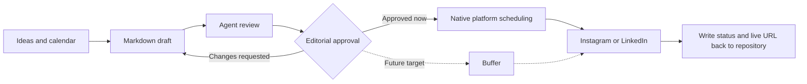
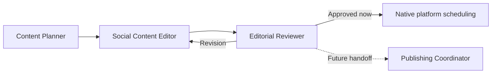

# VS Code tooling for social content planning

**Research date:** 2026-07-11  
**Scope:** Planning, drafting, reviewing, scheduling, and tracking Instagram and LinkedIn content for Qnit AG

## Executive summary

VS Code is well suited as the editorial source of truth for Qnit's social content, but it should not be treated as the publishing platform itself. The existing repository already provides a strong content-as-code foundation:

- Markdown files for individual posts
- Shared Instagram and LinkedIn templates
- Frontmatter fields for platform, format, owner, date, and status
- A central content calendar
- Brand voice and hashtag guidance
- Git history for traceability

The recommended setup is to use VS Code for planning, drafting, review, and approval. During the initial phase, approved content will be uploaded and scheduled manually in Instagram and LinkedIn using each platform's native planning tools. Buffer remains the future target for centralized scheduling and publishing once the editorial workflow and metadata are stable.

## Decision: native scheduling first, Buffer later

**Decision date:** 2026-07-11

Qnit will initially schedule uploads natively in Instagram and LinkedIn. No publishing service, publishing agent, MCP server, or platform API will be connected during this phase. The repository remains the editorial source of truth, while a person transfers approved content and assets to the relevant platform and records the scheduling or publication result in the content file.

Buffer remains the preferred future publishing layer because it can serve both Instagram and LinkedIn through one scheduling service. Reepl will not be adopted for the planned cross-platform workflow because its strongest capabilities are focused on LinkedIn and X/Twitter and it does not cover Instagram.

### What are Buffer and Reepl?

| Service | What it is | Relevance to Qnit |
| --- | --- | --- |
| Buffer | An external social-media management service for preparing, scheduling, and publishing content across channels including Instagram and LinkedIn. It offers a web interface, API, and MCP integration. | Preferred future target for centralized cross-platform publishing, but not part of the initial rollout. |
| Reepl | An external AI-assisted content service focused on LinkedIn and X/Twitter. Its MCP tools cover drafts, scheduling, publishing, carousels, voice profiles, and content libraries. | Not selected as the main publishing layer because it does not support Qnit's Instagram workflow. It may only be reconsidered for a separate LinkedIn-specific experiment. |

Both services operate outside VS Code and the Git repository. They would receive approved content from the repository; they would not replace Qnit's Markdown files, brand guidance, review process, or content calendar.

## Recommended workflow



The repository remains the authoritative editorial record. Native platform scheduling is the initial delivery method. In the future state, Buffer acts as the delivery layer rather than replacing the repository.

## Recommended VS Code extensions

### Core editorial stack

| Extension | ID | Purpose | Recommendation |
| --- | --- | --- | --- |
| Front Matter CMS | `eliostruyf.vscode-front-matter` | Content dashboard, metadata forms, filtering, media handling, taxonomies, and custom actions | Adopt first |
| Markdown All in One | `yzhang.markdown-all-in-one` | Faster Markdown authoring, tables, navigation, and preview support | Adopt |
| markdownlint | `davidanson.vscode-markdownlint` | Consistent Markdown structure and formatting | Adopt |
| Code Spell Checker | `streetsidesoftware.code-spell-checker` | Spelling checks for English captions and articles | Adopt and configure project terms |

### Review and workflow support

| Extension | ID | Purpose | Recommendation |
| --- | --- | --- | --- |
| GitHub Copilot Chat | `github.copilot-chat` | Drafting, adaptation, review, and custom agents and skills | Already installed; customize for this repository |
| GitHub Pull Requests | `github.vscode-pull-request-github` | Editorial review and approval through pull requests | Adopt for team approvals |
| GitLens | `eamodio.gitlens` | History, ownership, comparisons, and traceability | Useful for larger teams |
| Todo Tree | `gruntfuggly.todo-tree` | Collect explicit TODO markers across drafts | Optional; already installed |

### Extensions not recommended as the workflow foundation

Several Markdown Kanban extensions are available, but the relevant results had very small user bases and limited evidence of long-term maintenance. They would also introduce another status representation alongside frontmatter and the content calendar. Front Matter CMS is a better match for the current repository.

No established VS Code extension was found that should be trusted as a complete Instagram and LinkedIn scheduler. Qnit will therefore use the native platform planners initially and a dedicated service only in the future centralized workflow.

## Front Matter CMS fit

Front Matter CMS is the strongest direct fit because the post templates already use structured frontmatter:

```yaml
platform: LinkedIn
format: Post
owner:
target_date:
status: Draft
published_url:
```

Front Matter can expose these values through an editorial dashboard with filtering and controlled field values. Recommended additional fields are:

```yaml
scheduled_at:
scheduler:
scheduler_post_id:
campaign:
content_pillar:
```

During the native-scheduling phase, `scheduler` should contain `Instagram Native` or `LinkedIn Native`. `scheduler_post_id` may remain empty when the platform does not expose a useful scheduling identifier. `scheduled_at`, status, and the final `published_url` should still be recorded consistently. `Buffer` becomes the `scheduler` value only after the future integration is introduced.

Suggested controlled values:

- `platform`: `Instagram`, `LinkedIn`
- `format`: `Post`, `Story`, `Reel`, `Article`
- `status`: `Idea`, `Draft`, `Review`, `Approved`, `Scheduled`, `Published`
- `content_pillar`: `Expertise & insight`, `Events & industry`, `People of Qnit`, `Hiring`

### Source-of-truth concern

Dates and statuses currently appear both in individual post frontmatter and in the central content calendar. These values can drift apart. The preferred long-term model is:

1. Individual post files contain the authoritative metadata.
2. Front Matter CMS provides the editorial dashboard.
3. The Markdown calendar is generated from post metadata or retained only as a high-level campaign view.

## Recommended custom agents

Custom agents should live in `.github/agents/` and use the minimum tools needed for their role.

### Content Planner

**Purpose:** Analyze campaign themes, content pillars, cadence, platform balance, upcoming dates, and gaps.

**Suggested access:** Repository read and search, web research, and permission to update the calendar only after confirmation.

**Expected output:** A proposed schedule with rationale, owners still to assign, and links to briefs or draft placeholders.

### Social Content Editor

**Purpose:** Create or revise Instagram and LinkedIn content using the appropriate repository template.

**Suggested access:** Read and edit content files, but no publishing tools.

**Required context:** Brand voice, hashtag bank, relevant platform template, content brief, and campaign theme.

### Editorial Reviewer

**Purpose:** Review content without silently rewriting approved messaging.

**Suggested access:** Read-only tools where practical.

**Checks:**

- Brand voice and primary language
- Accuracy and unsupported claims
- Strength of hook and call to action
- Platform suitability
- Hashtag relevance
- Alt text and asset references
- Tagged partners and people
- Required frontmatter and valid status transition

### Publishing Coordinator

**Purpose:** Future role that transfers approved content to Buffer and writes the scheduling result back to the repository.

**Rollout status:** Deferred until after the native-scheduling phase.

**Suggested access:** Buffer MCP tools plus narrowly scoped repository edits.

**Mandatory safeguards:**

- Only process files with `status: Approved`.
- Show channel, complete content, assets, date, time, and timezone before scheduling.
- Require explicit human confirmation before every write operation to Buffer.
- Convert `Europe/Berlin` dates to UTC deliberately.
- Record `status: Scheduled`, `scheduled_at`, and `scheduler_post_id` only after a successful response.
- Never expose or store an API key in the repository.
- Never publish immediately unless the user explicitly requests and confirms it.

### Suggested agent handoff



## Recommended agent skills

Agent Skills should live in `.github/skills/<skill-name>/SKILL.md`. They are preferable to one large marketing instruction because VS Code loads them only when the task is relevant.

| Skill | Responsibility |
| --- | --- |
| `plan-content-calendar` | Analyze themes, dates, cadence, platform balance, and content gaps |
| `draft-linkedin-content` | Produce LinkedIn posts and articles from briefs and templates |
| `draft-instagram-content` | Produce feed posts, Stories, and Reel scripts from templates |
| `review-social-content` | Apply a consistent editorial, brand, accessibility, and completeness review |
| `repurpose-social-content` | Adapt an approved source across platforms without simple copy-and-paste duplication |
| `schedule-approved-content` | Future skill: validate the approval gate and schedule through Buffer after confirmation |
| `analyze-content-performance` | Retrieve published-post metrics and summarize platform and content-pillar performance |

### Instructions versus skills versus prompts

| VS Code primitive | Recommended use in this repository |
| --- | --- |
| `.instructions.md` | Automatically apply Qnit brand and file conventions to Instagram and LinkedIn content |
| Agent Skill | Reusable multi-step workflows such as drafting, reviewing, repurposing, or scheduling |
| Custom Agent | A bounded editorial role with a specific tool set and safety constraints |
| Prompt file | A single manual command such as creating one post from a selected brief |

A concise `.github/instructions/social-content.instructions.md` should apply to `instagram/**/*.md` and `linkedin/**/*.md`, reference the brand voice and hashtag bank, and avoid duplicating their full contents.

## Publishing options

### Initial approach: native Instagram and LinkedIn scheduling

Approved posts and assets will first be uploaded and scheduled directly in each platform's own interface. This avoids introducing credentials, MCP permissions, vendor synchronization, and automated write operations while Qnit establishes its editorial process.

The manual handoff should still follow a repeatable checklist:

1. Confirm that the content file has `status: Approved`.
2. Verify the target platform, account, complete copy, assets, alt text, date, time, and timezone.
3. Upload and schedule the content in the native platform interface.
4. Update the content file with `status: Scheduled`, `scheduled_at`, and the native scheduler name.
5. After publication, record `status: Published` and `published_url`.

This is an intentional rollout phase, not the long-term integration architecture.

### Future target: Buffer MCP or API

Buffer currently provides both a GraphQL API and an HTTP MCP server intended for agents and automation tools.

**MCP endpoint:** `https://mcp.buffer.com/mcp`

Relevant capabilities include:

- List connected organizations and channels
- Create and edit posts
- Add a post to the next queue slot
- Schedule a post for a specific UTC date and time
- Work with Instagram and LinkedIn metadata
- Attach media and configure Instagram post types
- Retrieve post status and, for some workflows, performance metrics

Buffer supports Instagram and LinkedIn alongside several other platforms. Its API exposes `addToQueue` and `customScheduled` scheduling modes.

### Buffer security considerations

A personal Buffer API key currently acts on behalf of the whole account and can access all organizations and channels available to that account. There is no per-organization scope for personal API keys.

Therefore:

- Do not commit the key to Git.
- Store it in a secure secret store or environment variable.
- Prefer OAuth with the minimum required scopes for a team integration.
- Consider a dedicated Buffer account if account-wide access is too broad.
- Keep approval and publishing as separate steps.

### Direct Instagram integration

Direct publishing through the Instagram Platform is possible but carries additional implementation and operational requirements:

- Instagram Professional Account
- Appropriate login flow and access token
- Content-publishing permissions
- Page Publishing Authorization where applicable
- Publicly accessible media for URL-based publishing, or the resumable upload workflow
- Container creation, processing-status checks, and final publishing calls
- Rate-limit and error handling

This is an integration project rather than a VS Code extension setup.

### Direct LinkedIn integration

LinkedIn's Posts API can create several forms of organic content, including text, images, videos, documents, articles, multi-image posts, and polls. Organization publishing requires permissions such as `w_organization_social` and an authenticated member with an appropriate company-page role.

The Community Management API is a vetted product with development and standard tiers. Access review, versioning, media upload, and organization permissions make a direct integration significantly more expensive to maintain than Buffer.

## Proposed implementation sequence

1. Install and configure Front Matter CMS.
2. Standardize frontmatter across all post, Story, Reel, and article templates.
3. Add project-specific social content instructions.
4. Add the Content Planner, Social Content Editor, and Editorial Reviewer agents.
5. Introduce pull requests as the human approval record.
6. Upload and schedule approved content natively in Instagram and LinkedIn while the editorial workflow stabilizes.
7. Record native scheduling timestamps, scheduler names, publication status, and live URLs in post frontmatter.
8. Generate the content calendar from post metadata to remove duplicate status and date maintenance.
9. Evaluate Buffer only after the native workflow is reliable and the required metadata is recorded consistently.
10. Connect Buffer MCP with a confirmation-gated Publishing Coordinator as the future centralized publishing layer.
11. Add performance analysis only after published URLs and scheduler IDs are recorded consistently.

## Risks and mitigations

| Risk | Mitigation |
| --- | --- |
| Calendar and post metadata diverge | Make post frontmatter authoritative and generate calendar views |
| Agent schedules unapproved content | Enforce `status: Approved` plus explicit human confirmation |
| Wrong timezone | Store timezone explicitly and show UTC conversion before scheduling |
| API key leaks into Git | Use environment variables or a secret store and secret scanning |
| Wrong social channel selected | Pin and display organization and channel IDs before confirmation |
| AI introduces unsupported claims | Use read-only editorial review and require source links for factual claims |
| Platform content becomes identical | Use a repurposing skill with platform-specific hooks, length, CTA, and asset rules |
| Vendor API changes | Keep publishing behind one Buffer integration and record scheduler IDs and errors |

## Recommendation

Adopt Front Matter CMS as the VS Code editorial interface, retain Markdown and Git as the source of truth, and use focused custom agents and skills for planning and quality control. Initially, upload and schedule approved content natively in Instagram and LinkedIn. Keep Buffer as the future centralized scheduling and publishing layer once the workflow is stable. Reepl is not part of the target architecture because it does not cover both required platforms. Do not give drafting or reviewing agents publishing access. When introduced later, the Publishing Coordinator should remain a separate, confirmation-gated role.

## Sources

- [VS Code: Custom agents](https://code.visualstudio.com/docs/agent-customization/custom-agents)
- [VS Code: Agent Skills](https://code.visualstudio.com/docs/agent-customization/agent-skills)
- [VS Code: Custom instructions](https://code.visualstudio.com/docs/agent-customization/custom-instructions)
- [VS Code: Prompt files](https://code.visualstudio.com/docs/agent-customization/prompt-files)
- [Front Matter CMS documentation](https://frontmatter.codes/docs/)
- [Buffer API](https://developers.buffer.com/)
- [Buffer MCP integration](https://developers.buffer.com/guides/integrations/mcp.html)
- [Buffer posts and scheduling](https://developers.buffer.com/guides/posts-and-scheduling.html)
- [Buffer authentication](https://developers.buffer.com/guides/authentication.html)
- [Instagram Platform content publishing](https://developers.facebook.com/docs/instagram-platform/content-publishing/)
- [LinkedIn Community Management overview](https://learn.microsoft.com/linkedin/marketing/community-management/community-management-overview?view=li-lms-2026-06)
- [LinkedIn Posts API](https://learn.microsoft.com/linkedin/marketing/community-management/shares/posts-api?view=li-lms-2026-06)